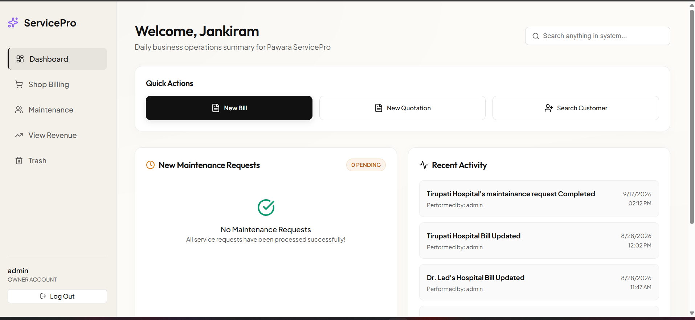
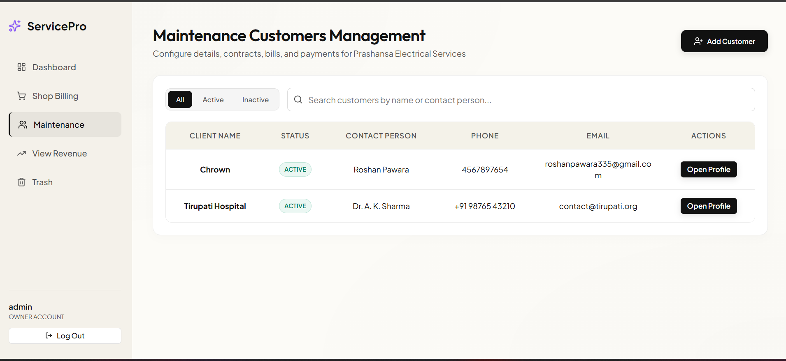
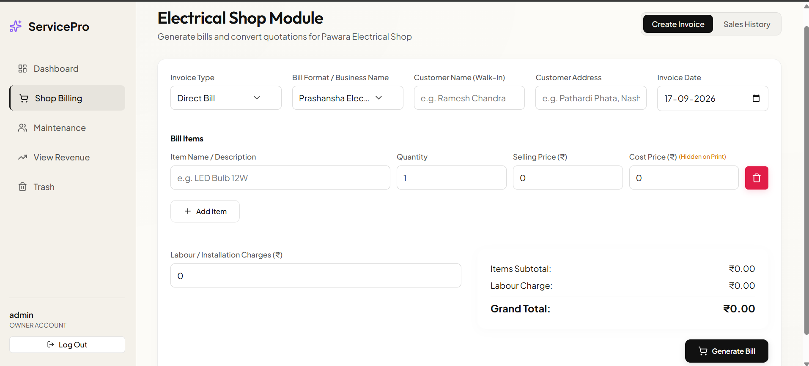
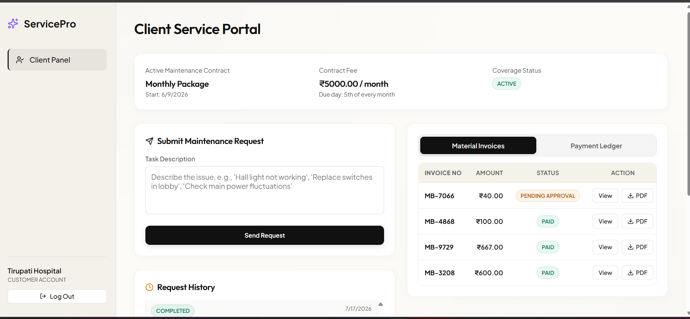
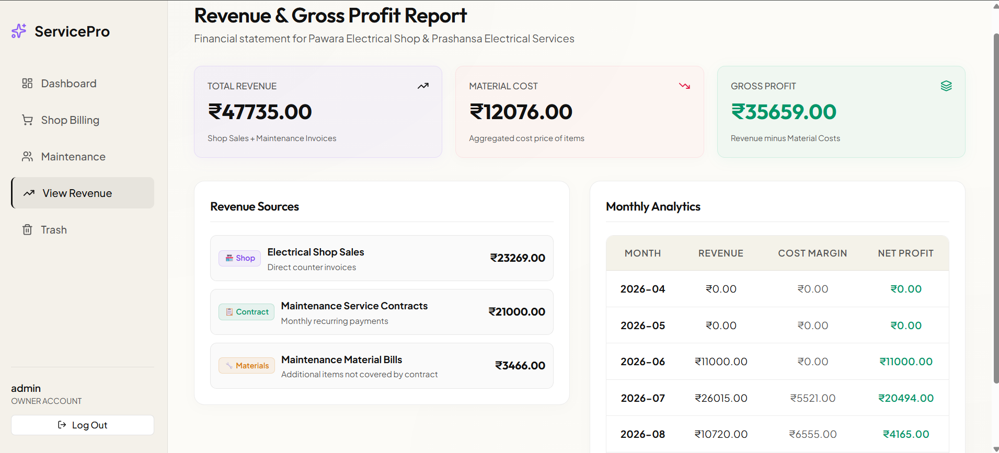

# Pawara ServicePro

> A full-stack business management platform for electrical services, maintenance operations, billing, quotations, contracts, and customer management.

Pawara ServicePro is a web-based business management system designed to digitize the day-to-day operations of an electrical service and retail business.

The system provides separate **Owner** and **Customer** portals and brings customer management, maintenance requests, billing, quotations, contracts, payments, and revenue analytics into a single platform.

---

## 🚀 Features

### 🔐 Authentication & Security

- JWT-based authentication
- Role-based authorization
- Separate Owner and Customer access
- Spring Security integration
- BCrypt password hashing
- Password reset through secure email tokens
- Password reset tokens are:
  - Cryptographically generated
  - SHA-256 hashed before storage
  - Time-limited
  - Single-use
- Protected REST APIs
- CORS configuration

---

### 👥 Customer Management

Owners can:

- Create customers
- View customer information
- Update customer details
- Activate/deactivate customers
- Manage customer lifecycle
- Restore customers from trash
- Permanently delete customers

Customers have their own self-service portal to access relevant services and requests.

---

### 🛠️ Maintenance Request Management

The system allows maintenance requests to be tracked digitally.

Owners can:

- View maintenance requests
- Track request status
- Manage customer service requests
- Generate material bills associated with maintenance work

Customers can:

- Submit maintenance requests
- View their request information
- Track maintenance activity

---

### 🧾 Billing & Quotations

The platform supports different billing workflows including:

- Shop bills
- Quotations
- Maintenance material bills
- Bill items and material tracking

A quotation can be converted into a bill, reducing duplicate data entry.

Bills contain item-level information such as:

- Material/item name
- Quantity
- Price
- Material cost
- Total amount

Invoices can also be generated as PDF documents from the frontend.

---

### 📋 AMC / Contract Management

The system supports maintenance contracts for customers.

Contract management includes:

- Contract information
- Customer association
- Contract tracking
- Contract payments
- Maintenance-related operations

---

### 💰 Payment Ledger

The platform maintains payment records associated with customers and business transactions.

Payment information can be used for tracking:

- Contract payments
- Customer payments
- Transaction history

---

### 📊 Revenue & Profit Analytics

The Owner dashboard provides business analytics including:

- Total revenue
- Material cost
- Gross profit
- Shop revenue
- Maintenance material revenue
- Contract revenue
- Monthly revenue breakdown

This provides an overview of the financial performance of the business.

---

### 📝 Activity Audit Log

Important owner-side activities can be recorded through the activity logging system.

This provides an audit trail for important business operations.

---

### 🗑️ Trash Management

Instead of immediately removing records, selected customer data can be moved to a trash state.

The system supports:

- Deactivation
- Trash management
- Restoration
- Permanent deletion

---

## 🏗️ System Architecture

```text
                    ┌──────────────────────┐
                    │      User / Client   │
                    └──────────┬───────────┘
                               │
                               ▼
                    ┌──────────────────────┐
                    │   React + Vite SPA   │
                    │      Frontend        │
                    └──────────┬───────────┘
                               │
                         Axios + JWT
                               │
                               ▼
                    ┌──────────────────────┐
                    │   Spring Boot API    │
                    │      Backend         │
                    └──────────┬───────────┘
                               │
                    ┌──────────▼───────────┐
                    │ Spring Security /    │
                    │ JWT Authentication   │
                    └──────────┬───────────┘
                               │
                               ▼
                    ┌──────────────────────┐
                    │      REST APIs       │
                    │     Controllers      │
                    └──────────┬───────────┘
                               │
                               ▼
                    ┌──────────────────────┐
                    │ Spring Data JPA      │
                    │ Hibernate / Repos    │
                    └──────────┬───────────┘
                               │
                               ▼
                    ┌──────────────────────┐
                    │ PostgreSQL / Supabase│
                    └──────────────────────┘
```

---

## 🧰 Tech Stack

### Frontend

- React
- Vite
- React Router
- Axios
- Lucide React
- jsPDF
- jsPDF AutoTable
- CSS

### Backend

- Java
- Spring Boot
- Spring Security
- Spring Data JPA
- Hibernate
- JWT
- Lombok
- Spring Mail
- Maven

### Database

- PostgreSQL
- Supabase

### Development Tools

- Git
- GitHub
- Postman
- VS Code
- IntelliJ IDEA
- Maven

The project uses React on the frontend and Spring Boot with Spring Security, JPA/Hibernate, and PostgreSQL/Supabase on the backend. :contentReference[oaicite:1]{index=1}

---

## 📁 Project Structure

```text
Pawara-ServicePro/
│
├── public/
│
├── src/
│   ├── components/
│   │   ├── auth/
│   │   ├── common/
│   │   ├── customer/
│   │   └── owner/
│   │
│   ├── context/
│   │   └── AuthContext
│   │
│   ├── layouts/
│   │   ├── OwnerLayout
│   │   └── CustomerLayout
│   │
│   ├── routes/
│   │   ├── AppRoutes
│   │   └── ProtectedRoute
│   │
│   ├── services/
│   │   ├── api
│   │   └── authService
│   │
│   ├── utils/
│   │   └── generateInvoicePDF
│   │
│   └── main.jsx
│
├── backend/
│   ├── src/
│   │   ├── main/
│   │   │   ├── java/
│   │   │   │   └── com/
│   │   │   │       └── pawara/
│   │   │   │           └── servicepro/
│   │   │   │               ├── controller/
│   │   │   │               ├── dto/
│   │   │   │               ├── model/
│   │   │   │               ├── repository/
│   │   │   │               ├── security/
│   │   │   │               └── service/
│   │   │   │
│   │   │   └── resources/
│   │   │
│   │   └── test/
│   │       └── ...
│   │
│   └── pom.xml
│
├── package.json
├── vite.config.js
├── index.html
├── .env.example
├── .gitignore
└── README.md
```

> **Note:** The React frontend is located directly in the root `src/` directory. There is no separate `frontend/` directory.

---

## 🔄 Core Workflows

### Customer Workflow

```text
Customer Registration
        ↓
Customer Login
        ↓
Customer Portal
        ↓
Submit Maintenance Request
        ↓
Track Request
        ↓
View Related Information
```

### Quotation → Bill Workflow

```text
Create Quotation
       ↓
Review Quotation
       ↓
Convert Quotation
       ↓
Generate Bill
       ↓
Generate Invoice
```

### Maintenance Billing Workflow

```text
Maintenance Request
        ↓
Service / Maintenance Work
        ↓
Add Materials
        ↓
Create Material Bill
        ↓
Record Business Transaction
```

### Revenue Workflow

```text
Shop Bills
     │
     ├──────────────┐
     │              │
Maintenance      Contract
Material Bills    Payments
     │              │
     └──────┬───────┘
            ↓
      Revenue Analytics
            ↓
      Material Costs
            ↓
       Gross Profit
```

---

## 🔒 Security Architecture

The backend uses Spring Security with JWT authentication.

```text
Client
  │
  │ Authorization: Bearer <JWT>
  ▼
JwtAuthenticationFilter
  │
  ├── Validate JWT
  │
  ├── Extract User Information
  │
  └── Set SecurityContext
          │
          ▼
    Spring Security
          │
          ▼
      REST API
```

The application protects owner and customer API routes using role-based authorization.

```text
/api/auth/**        → Public authentication endpoints

/api/owner/**       → ROLE_OWNER

/api/customer/**    → ROLE_CUSTOMER
```

CSRF is disabled for the stateless JWT-based API, while CORS is configured for frontend access.

---

## 🗄️ Database Design

The application uses PostgreSQL through Supabase.

Main entities include:

```text
User
 │
 └── Customer
       │
       ├── Contract
       │
       ├── Maintenance Requests
       │       │
       │       └── Bill
       │             │
       │             └── Bill Items
       │
       ├── Bills
       │
       └── Payments

Activity Logs
```

### Main Entities

- Users
- Customers
- Contracts
- Bills
- Bill Items
- Maintenance Requests
- Payments
- Activity Logs

The database relationships include one-to-one, one-to-many, and maintenance-request-to-bill relationships. :contentReference[oaicite:2]{index=2}

---

## 🌐 REST API

The backend exposes REST APIs for the major application modules.

```text
/api/auth/**
/api/owner/customers/**
/api/owner/bills/**
/api/owner/requests/**
/api/owner/dashboard
/api/owner/revenue
/api/owner/activities
/api/customer/**
```

The frontend communicates with these APIs using Axios and JWT authentication. :contentReference[oaicite:3]{index=3}

---

## 🖥️ Frontend Architecture

The React application follows a component-based architecture.

```text
main.jsx
   ↓
BrowserRouter
   ↓
AuthProvider
   ↓
App
   ↓
AppRoutes
   ├── Public Routes
   ├── Owner Routes
   └── Customer Routes
```

Protected routes ensure that authenticated users can access only the areas allowed by their role.

Axios interceptors are used to attach JWT tokens to API requests and handle unauthorized responses. :contentReference[oaicite:4]{index=4}

---

## ⚙️ Backend Architecture

The Spring Boot backend is organized into:

```text
controller/
    ↓
dto/
    ↓
repository/
    ↓
model/

security/
    ↓
JWT Authentication

service/
    ↓
Application-specific services
```

The backend uses Spring Data JPA and Hibernate to interact with PostgreSQL.

The implementation uses controllers, repositories, entities, security components, and selected service components rather than enforcing a separate service class for every controller. :contentReference[oaicite:5]{index=5}

---

## 🧪 Testing

The project includes backend security testing, including:

```text
PasswordResetSecurityTest.java
```

The password-reset flow includes security protections such as:

- Anti-user-enumeration behavior
- Cryptographically secure token generation
- Hashed token storage
- Token expiration
- Single-use token invalidation
- BCrypt password hashing

---

## 💻 Local Setup

### Prerequisites

Make sure you have installed:

- Node.js
- npm
- Java 22
- Maven
- PostgreSQL / Supabase database
- Git

---

### 1. Clone the Repository

```bash
git clone https://github.com/RoshanPawara54/Pawara-ServicePro.git
```

```bash
cd Pawara-ServicePro
```

---

### 2. Configure Frontend

Install dependencies from the **project root**:

```bash
npm install
```

Create/configure your environment variables according to `.env.example`.

For local development, the frontend API URL should point to your Spring Boot backend.

Example:

```env
VITE_API_URL=http://localhost:8080
```

Do not commit passwords, JWT secrets, database credentials, email credentials, or other secrets to GitHub.

---

### 3. Start the Frontend

From the project root:

```bash
npm run dev
```

The Vite development server will start the React application.

---

### 4. Configure Backend

Open the backend directory:

```bash
cd backend
```

Configure the required application properties for:

- PostgreSQL/Supabase database
- JWT secret
- Email configuration
- Server configuration

Keep all credentials and secrets outside the public repository.

---

### 5. Start the Backend

```bash
mvn spring-boot:run
```

The Spring Boot API runs on the configured backend port.

For local development, the backend is configured around:

```text
http://localhost:8080
```

---

## 🔌 Frontend ↔ Backend

When running locally:

```text
React / Vite
localhost:5173
      │
      │ Axios + JWT
      ▼
Spring Boot
localhost:8080
      │
      ▼
PostgreSQL / Supabase
```

---

## 📈 Engineering Highlights

This project demonstrates practical implementation of:

- Full-stack web application development
- Java Spring Boot REST API development
- JWT authentication
- Role-based authorization
- Spring Security
- JPA / Hibernate
- PostgreSQL database design
- React component architecture
- Protected frontend routes
- Axios request/response interceptors
- CRUD operations
- Business workflow automation
- Billing and quotation management
- Revenue analytics
- PDF invoice generation
- Password reset security
- Audit logging
- Customer self-service functionality

---

## 🔮 Future Improvements

Potential future improvements include:

- Cloud deployment
- Automated backups
- Advanced reporting
- More granular permissions
- Notification improvements
- Automated testing expansion
- Performance monitoring
- Additional analytics
- Mobile application support

---

## 🔐 Privacy & Security

This repository is intended to contain the application source code only.

Do not add:

```text
.env
Database credentials
JWT secrets
Email passwords
Private customer information
Production credentials
Private business documents
```

Use `.env.example` to document required environment variables without exposing actual values.

---

## 👨‍💻 Author

**Roshan Pawara**

Computer Engineering Graduate  
Backend Developer | Java & Spring Boot

- GitHub: [RoshanPawara54](https://github.com/RoshanPawara54)
- LinkedIn: [Roshan Pawara](https://linkedin.com/in/roshan-pawara-9a2568333)

---

## ⭐ Project

If you find this project useful or interesting, consider giving the repository a ⭐.

## 📸 Screenshots

### Owner Dashboard



### Customer Management



### Billing & Invoices



### Maintenance Requests



### Revenue Analytics


